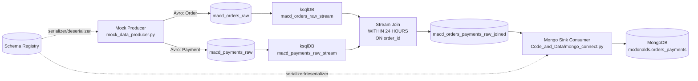

# McDonald's Streaming Pipeline: Kafka -> ksqlDB -> MongoDB

This repository generates mock McDonald's order/payment events, streams them through Kafka and ksqlDB, and persists them into MongoDB.

## Complete Architecture

This project follows an event-driven streaming architecture with schema-governed events and an operational sink into MongoDB.

### Logical Architecture



### Physical / Runtime Architecture

1. Python Producer Runtime
- Runs `mock_data_producer.py`.
- Uses `SerializingProducer` and Avro serialization.
- Publishes to order/payment Kafka topics.

2. Kafka Cluster
- Stores immutable event streams.
- Carries raw topics and joined output topic.

3. Schema Registry
- Stores Avro schemas for producers/consumers.
- Enforces data contract compatibility.

4. ksqlDB Runtime
- Creates streams over raw topics.
- Performs stream-stream join by `order_id` with 24-hour window.
- Writes enriched output to joined topic.

5. Python Mongo Sink Runtime
- Runs `Code_and_Data/mongo_connect.py` as consumer service.
- Deserializes Avro payloads.
- Upserts documents into MongoDB collection.

6. MongoDB
- Serves as analytical/operational store for consumed events.

### Topic and Stream Design

1. Raw Topics
- `macd_orders_raw`: order events.
- `macd_payments_raw`: payment events.

2. Processing Streams (ksqlDB)
- `macd_orders_raw_stream`
- `macd_payments_raw_stream`

3. Enriched Output Topic
- `macd_orders_payments_raw_joined`: joined order + payment records.

### Data Contract Design

1. Order Event Schema (`orders_avro_schema.json`)
- Includes `order_id`, `customer_id`, `order_total`, `order_items`, `order_time`.

2. Payment Event Schema (`payments_avro_schema.json`)
- Includes `payment_id`, `order_id`, `payment_amount`, `payment_method`, `payment_time`.

3. Join Key
- `order_id` is the correlation key used across order and payment events.

### End-to-End Data Flow

1. Producer creates correlated order/payment events.
2. Events are serialized with Avro and sent to Kafka raw topics.
3. ksqlDB reads both streams and performs temporal join (`WITHIN 24 HOURS`).
4. Joined records are published to `macd_orders_payments_raw_joined`.
5. Mongo sink consumes configured topic and writes/upserts into MongoDB.

### Sink Write Strategy (MongoDB)

1. `MONGO_SINK_MODE=orders`
- Upsert by `order_id`.

2. `MONGO_SINK_MODE=payments`
- Upsert by `payment_id`.

3. `MONGO_SINK_MODE=joined`
- Upsert by composite key (`order_id` + `payment_id`).

This ensures idempotent writes and safer reprocessing behavior.

### Reliability and Delivery Semantics

1. Producer Reliability
- Delivery callbacks confirm produce status.
- Batched `poll()` with final `flush()` reduces overhead.

2. Consumer Reliability
- `enable.auto.commit=false` and explicit `commit(msg)` after successful Mongo write.
- If processing fails before commit, event can be re-read.

3. Practical Semantics
- End-to-end behavior is at-least-once.
- Mongo upserts reduce duplicate impact during retries.

### Security Architecture

1. Credentials are externalized via `.env` (not hardcoded in code).
2. Kafka uses SASL/SSL configuration.
3. Schema Registry uses API key/secret authentication.
4. MongoDB uses URI-based authenticated connection.

### Observability and Operations

1. Logs
- Producer prints delivery reports.
- Sink prints startup state and fatal errors.

2. Core Operational Checks
- Verify topic lag on sink consumer group.
- Verify document counts in Mongo collection.
- Validate schema compatibility before schema changes.

3. Failure Points to Monitor
- Schema mismatch errors.
- Authentication/authorization failures.
- Join output gaps due to missing correlation events or time window mismatch.

### Recommended Production Enhancements

1. Add Dead Letter Queue (DLQ) topic for sink failures.
2. Add retry/backoff policy with capped attempts in sink.
3. Add structured logging and metrics export (Prometheus/OpenTelemetry).
4. Add containerized deployment (`Dockerfile` + `docker-compose`).
5. Add CI checks for schema validation and linting.

## Project Structure

- `mock_data_producer.py`: Kafka producer for orders and payments.
- `orders_avro_schema.json`: Avro schema for order events.
- `payments_avro_schema.json`: Avro schema for payment events.
- `ksql_db_commands.sql`: ksqlDB stream creation and join query.
- `Code_and_Data/mongo_connect.py`: Kafka consumer that writes to MongoDB.
- `.env.example`: environment variable template.
- `requirements.txt`: Python dependencies.

## Prerequisites

- Python 3.10+
- Confluent Kafka cluster (or compatible Kafka + Schema Registry)
- ksqlDB access
- MongoDB instance (Atlas or self-hosted)

## Setup

1. Create and activate a virtual environment.

```powershell
python -m venv .venv
.\.venv\Scripts\Activate.ps1
```

2. Install dependencies.

```powershell
pip install -r requirements.txt
```

3. Create `.env` from the template and fill all required credentials.

```powershell
Copy-Item .env.example .env
```

4. Ensure Kafka topics exist:
- `macd_orders_raw`
- `macd_payments_raw`
- `macd_orders_payments_raw_joined` (created by ksqlDB query)

## Run Order

1. Run producer:

```powershell
python .\mock_data_producer.py
```

2. In ksqlDB, run commands from `ksql_db_commands.sql`.

3. Run Mongo sink consumer:

```powershell
python .\Code_and_Data\mongo_connect.py
```

## Environment Variables

### Shared Kafka / Schema Registry

- `KAFKA_BOOTSTRAP_SERVERS`
- `KAFKA_SECURITY_PROTOCOL` (default: `SASL_SSL`)
- `KAFKA_SASL_MECHANISMS` (default: `PLAIN`)
- `KAFKA_API_KEY`
- `KAFKA_API_SECRET`
- `SCHEMA_REGISTRY_URL`
- `SCHEMA_REGISTRY_API_KEY`
- `SCHEMA_REGISTRY_API_SECRET`

### Producer (`mock_data_producer.py`)

- `ORDERS_TOPIC` (default: `macd_orders_raw`)
- `PAYMENTS_TOPIC` (default: `macd_payments_raw`)
- `ORDERS_SUBJECT` (default: `<ORDERS_TOPIC>-value`)
- `PAYMENTS_SUBJECT` (default: `<PAYMENTS_TOPIC>-value`)
- `ORDERS_SCHEMA_FILE` (default: `orders_avro_schema.json`)
- `PAYMENTS_SCHEMA_FILE` (default: `payments_avro_schema.json`)
- `MOCK_MESSAGE_COUNT` (default: `100`)
- `MOCK_SLEEP_SECONDS` (default: `1`)

### Mongo Sink (`Code_and_Data/mongo_connect.py`)

- `CONSUME_TOPIC` (required)
- `CONSUME_SUBJECT` (default: `<CONSUME_TOPIC>-value`)
- `KAFKA_CONSUMER_GROUP` (default: `mongo-sink-group`)
- `KAFKA_AUTO_OFFSET_RESET` (default: `earliest`)
- `MONGODB_URI` (required)
- `MONGODB_DB` (default: `mcdonalds`)
- `MONGODB_COLLECTION` (default: `orders_payments`)
- `MONGO_SINK_MODE` (`orders`, `payments`, or `joined`; default: `joined`)

## Common Modes for Mongo Sink

Consume joined stream:
- `CONSUME_TOPIC=macd_orders_payments_raw_joined`
- `CONSUME_SUBJECT=macd_orders_payments_raw_joined-value`
- `MONGO_SINK_MODE=joined`

Consume only orders raw topic:
- `CONSUME_TOPIC=macd_orders_raw`
- `CONSUME_SUBJECT=macd_orders_raw-value`
- `MONGO_SINK_MODE=orders`

Consume only payments raw topic:
- `CONSUME_TOPIC=macd_payments_raw`
- `CONSUME_SUBJECT=macd_payments_raw-value`
- `MONGO_SINK_MODE=payments`

## What Was Fixed

- Removed hardcoded credentials from source code.
- Added `.env`-based configuration for all services.
- Replaced old MongoDB demo script with a real Kafka-to-Mongo sink.
- Corrected stream names in `ksql_db_commands.sql` join query.
- Added missing project files for setup and dependency management.

## Security Note

Credentials were previously committed in source files. Rotate all exposed API keys/secrets immediately in your Confluent and MongoDB accounts.
